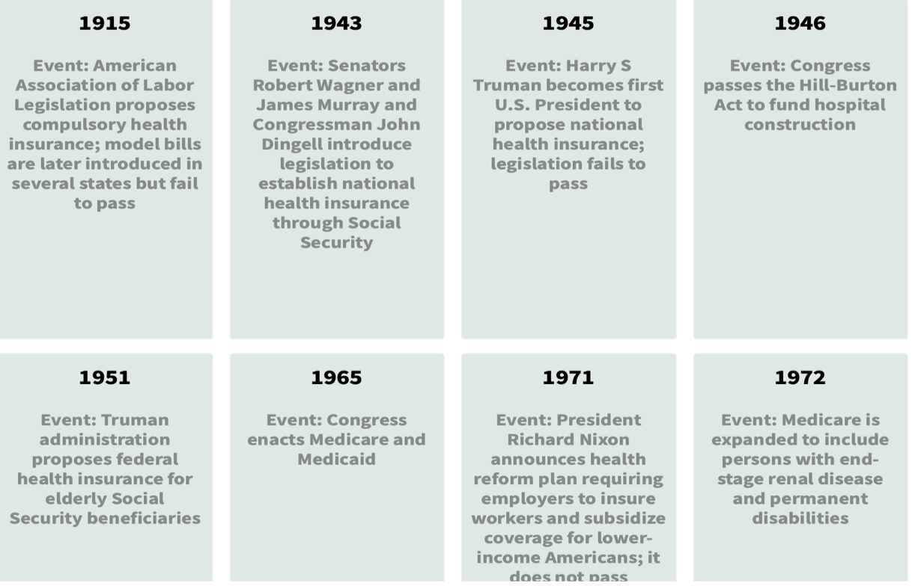
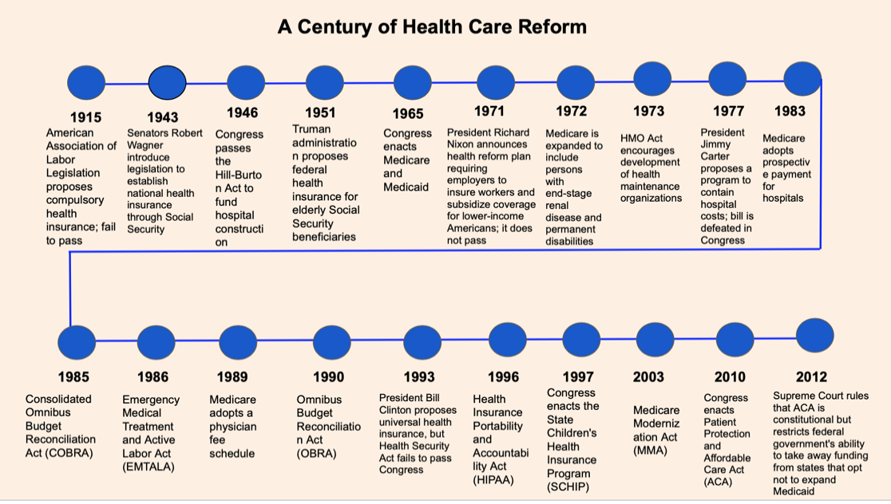

# Assignment3&4

## Orginal Visualization 

[Link to original visualization](https://www.nejm.org/doi/full/10.1056/nejmp1202111)

I decided to use this particular visualization because when I was reading the article Unfinished Journey-A Century of Health Care Reform in the United States, I found it difficult to understand. It was particularly difficult to identify efforts in the United States who have failed to make changes in the Health Care system and the events that were enacted. The visualization was also a bit difficult to read and quickly identify what it was trying to accomplish. There were unnecessary things used in the timeline and no title guiding busy readers. To make it easier to understand I decided to try new ways to redesign it.

## Sketch 

This drawing is a potential solution to the original visualization problem. I decided not to include small lines to represent all the years. Instead, I decided to show only the most important dates and provide descriptions in boxes to help readers better understand the information. 
I also decided to add a title to the visualization so busy readers can easily follow along. My friends mentioned that my drawing was better compared to the original one, but they were confused about the colors that I used and the reason I highlighted reforms that failed to pass. 
I did this because when I was discussing this paper in my health policy class it was difficult to tell which reforms failed.
When I highlighted them, I noticed that multiple health care reforms failed to pass but could have made an impact in the United States. 
Since my friends did not understand, I will change the colors I used and not highlight the reforms that failed to pass. 

## Feedback 

## First Solution Attempt 

This is my first solution attempt using Flourish. I thought it might be good to have all the dates in a way that is easier to read. As I started working on this design, I noticed that it might not work for this example because there were 22 dates. Having all the dates will make it hard to read. 
In addition, this visualization is not appropriate for a general audience. People in the healthcare industry might find too much information irrelevant to the field and might not serve the purpose of the paper. My classmates agreed that it felt more like a to-do list than a timeline. So, I decided to take a different approach. 

## Best Result 

This is the best result based on the feedback provided by my classmates. My classmates mentioned that it was hard to understand the original graph without a title in the article and it had too much information. My classmates mentioned that my first sketch was confusing by using dark and light blue colors because it had no meaning. They suggested finding a new way to not have the dates crowded and to only mention the necessary information. I found this graph in a health policy paper for people familiar with health care reforms in the United States. Keeping this in mind, I decided to include only the name of the reforms, agencies, and governments instead of providing a full description. 
The context in the paper provides the necessary information about each event and its implications in health care reform. It will sound repetitive if that information is added in the final visualization. Instead, the final visualization serves as a guide and point of reference for readers with consistent and pleasing colors. However, due to software limitations, I   was not able to create this visualization with one of the software required by the class because they, unfortunately, do not have this design.

## Final Result 

This is my final result. I decided to use colors that emphasize the events in health care reform in the United States. I decided on this visualization for the online journal. I think a more interactive visualization will allow readers to learn about major events in health care reform. I also added a new title.   
