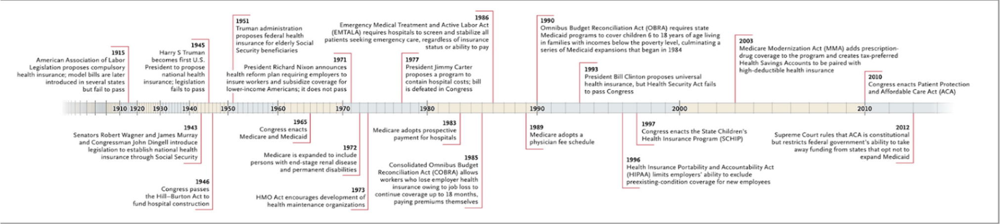
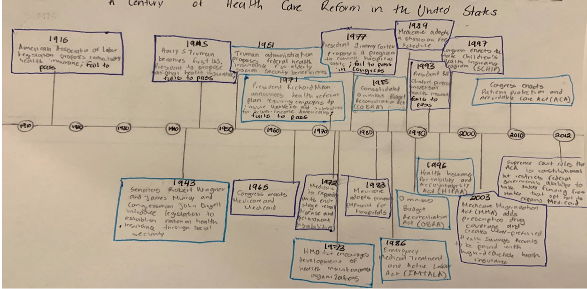
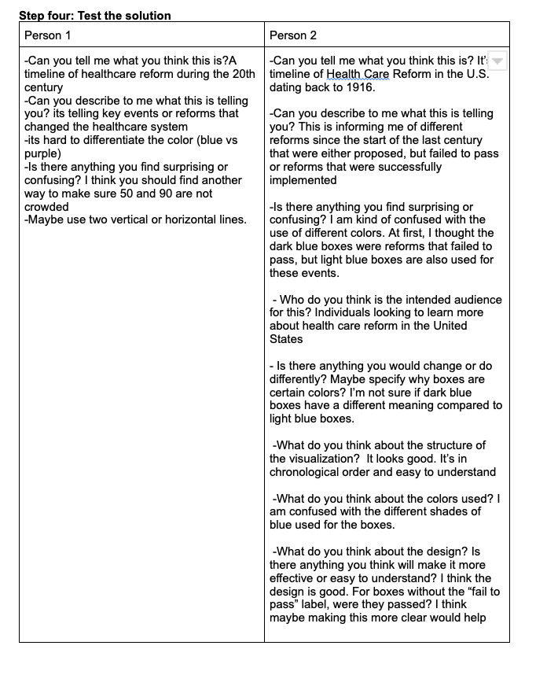

# Assignment3&4

## Orginal Visualization 

[Link to original visualization](https://www.nejm.org/doi/full/10.1056/nejmp1202111)

I decided to use this particular visualization because when I was reading the article Unfinished Journey-A Century of Health Care Reform in the United States, I found it difficult to identify efforts in the United States who have failed to make changes in the Health Care system and the events that were enacted. 
It was also a bit difficult to read and quickly identify what it was trying to accomplish. There were also unnecessary things used in the timeline and no title guiding busy readers. To make it easier to understand I decided to try new ways to redesign it.

## Sketch 

This is how I decided to draw a potential solution to the original visualization problem. I decided to not include small lines to represent all the years. Instead I decided to only show the most important dates and provide descriptions in boxes to help readers better understand the information that is being presented. 
I also decided to add a title to the visualization so busy readers can easily understand what is being presented. My friends mentioned that the design was better compared to the original one, but were confused about the colors that I used and the fact that I highlighted reforms that failed to pass. 
I did this because when I was discussing this paper in class it was difficult to tell which reforms failed.
When I highlighted them I noticed that there were a lot of health care reforms that failed to pass but could have made a huge impact in the United States. 
Since my friends did not understand, I will change the colors that I used and not highlight the reforms that failed to pass. 

## Feedback 

## First Solution Attempt 

This was my first solution attempt using Flourish. I thought that it would be good to have all the dates in a way that is easier to read. As I started working on this design I noticed that it might not work for this case because there were 22 dates and it will take time to look at all of them. 
In addition, this visualization is not appropriate for the audience. People in the healthcare industry might find this as irrelevant to the field and might not serve the right purpose in the paper. My classmates agreed that it felt more like a todo list than a timeline. So, I decided to take another approach. 

## Best Result 

This the best result based on the feedback provided in class. My classmates mentioned that it was hard to understand the original graph without a title in the article and that there was too much information. They also mentioned that my first sketch was confusing by using dark and light blue because it had no meaning. 
They suggested finding a way where the dates will not look crowded and to just mention the necessary information. I found this graph in a health policy paper for people that are familiar with health care reforms in the United States. Keeping this in mind, I decided to include only the name of the reforms, agencies, and governments instead of providing a full description. 
The paper as it progresses provides the necessary information about each event and their implications in health care reform. It will sound repetitive if that information is included in the best visualization. Instead the best visualization serves as a guide and point of reference for readers with consistent and pleasing colors. However due to software limitations, I was unable to create this visualization with one the softwares required by class because they unfortunately do not have this design. 

## Final Result 

This is my final result. I decided to use colors that emphsizes the events in health care reform in the United States. I think a more interactive visualization in the online journal will allow readers to easily learn about major events in health care reform. 
