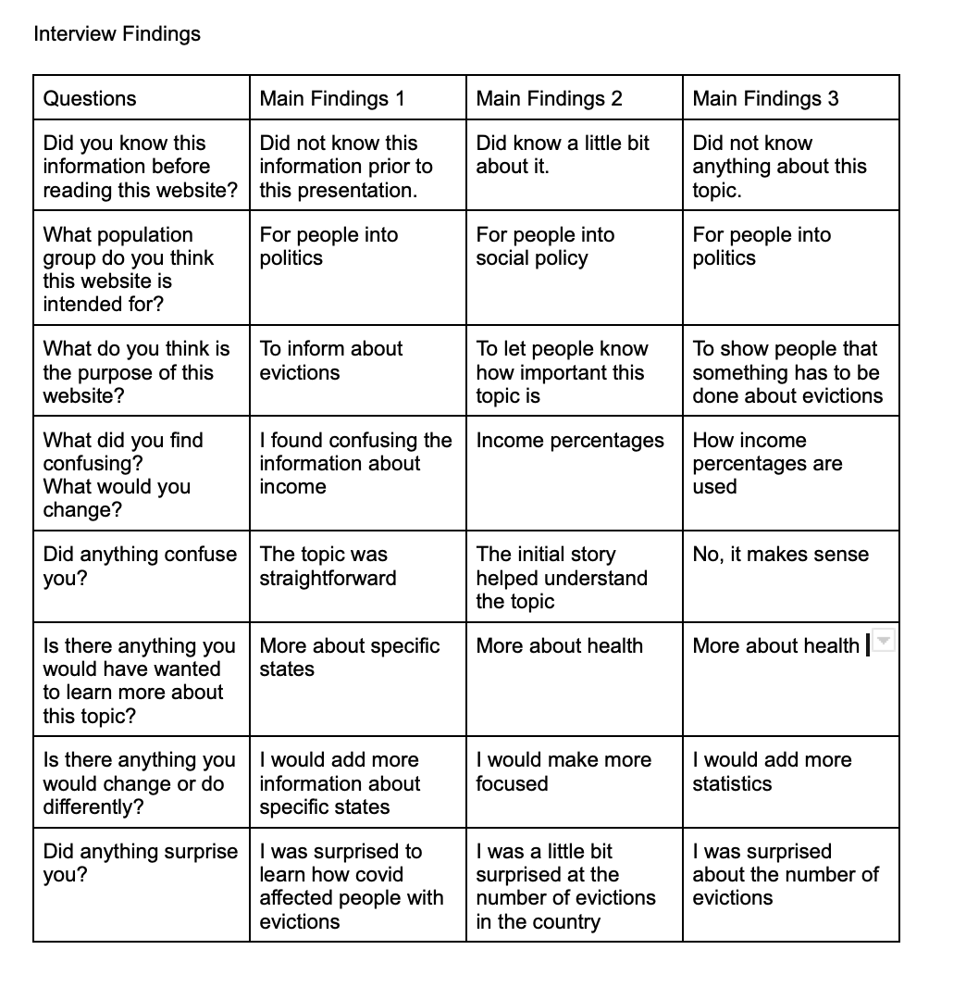

# Part II Final Project 

## Draft 

I used PowerPoint to layout my work before I move it to Shorthand. I think this method allowed me to create a strong story, include only necessary information, and find the theme I was to use in my presentation. This was an easy way for me to layout my ideas. 

(https://docs.google.com/presentation/d/1Cgx0j2WyrUfR79_EQiSOLeTiI1AK2XXAhLBd80l5HuY/edit#slide=id.g116084ecf8e_0_23)

## Interview Findings 

