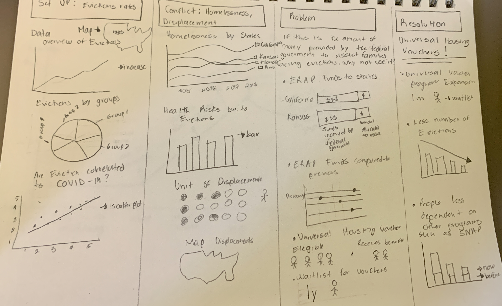
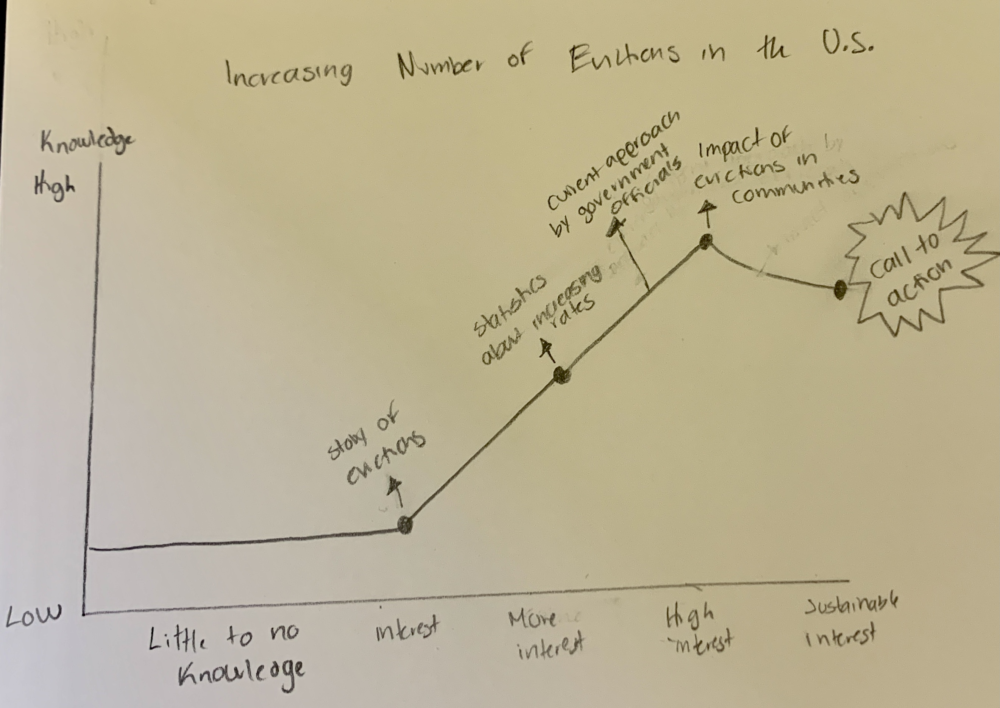

# Final Project Part I

## Outline

Summary of project: For my project, I am interested in showing the growing number of evictions in the country, the way government officials are addressing this problem, the implications of evictions in communities, and what actions are needed to address this issue. This is with the purpose of informing the audience and hopefully motivating them to take action. 

Setup: We all know that evictions in the country are increasing. 
Conflict: Evictions affect families in multiple ways and the people involved in the process. 
Resolution: A universal voucher housing system will help solve this problem. 

## Datasets

- Nebraska is debating about applying for additional funds for rent-eviction relief 
(https://www.wowt.com/2022/02/11/nebraska-organizations-debate-over-federal-funds-rent-eviction-relief/)

- UNL project focused on reducing and assisting families with evictions 
(https://journalstar.com/news/local/education/nebraska-college-of-law-recognized-nationally-for-tenant-assistance-project/article_4d6c8531-05f9-534a-b1f0-225ef4ccaea7.html)

- More about how UNL project works 
(https://www.ketv.com/article/local-law-students-help-families-facing-eviction/38988044#)

- Adequacy of housing policies in response to COVID-19 pandemic in the United States as of May 2021, by state 
(https://www.statista.com/statistics/1111306/policy-housing-states-covid19-usa/)

- Nebraska Homelessness Statistics 
(https://www.usich.gov/homelessness-statistics/ne/)

- Homelessness light increase in 2020 compared to 2019 
(https://www.3newsnow.com/news/local-news/slight-homelessness-increase-in-nebraska-when-comparing-2019-to-2020)

- Evictions are expected to increase in Nebraska 
(https://www.usnews.com/news/best-states/nebraska/articles/2021-07-30/explainer-evictions-are-expected-to-increase-in-nebraska)

- Shortage of rental homes and affordable  for low-income families 
(https://nlihc.org/housing-needs-by-state/nebraska)

- Universal housing vouchers 
(https://www.huduser.gov/portal/pdredge/pdr-edge-trending-110921.html)

- Expiring Eviction Moratoriums and COVID-19 Incidence and Mortality 
(https://academic.oup.com/aje/article/190/12/2503/6328194)

- Eviction And Health: A Vicious Cycle Exacerbated By A Pandemic 
(https://www.healthaffairs.org/do/10.1377/hpb20210315.747908/full/)

- Research suggests ending eviction moratoriums led to spikes in COVID cases and deaths 
(https://newsroom.ucla.edu/releases/ending-eviction-moratoriums-increased-covid-cases)

- Preventing Evictions Remains Critical to Controlling COVID-19, Study Finds 
(https://www.pennmedicine.org/news/news-releases/2021/april/preventing-evictions-remains-critical-to-controlling-covid19-study-finds)

- Pandemic Relief: The Emergency Rental Assistance Program 
(https://crsreports.congress.gov/product/pdf/R/R46688)

## Sketches 
This visualization represents my perspective about the levels of interest of the audience about evictions. 

## Method and Medium 

I will complete my project using Shorthand. By looking at the presentations in class, I think it makes sense to use it as it provides an easy way to show complex information. I think Shorthand will allow me to be more creative about how I present my topic. Additionally, I plan to use Tableau and Flourish to create the visualizations I need for my project. 

